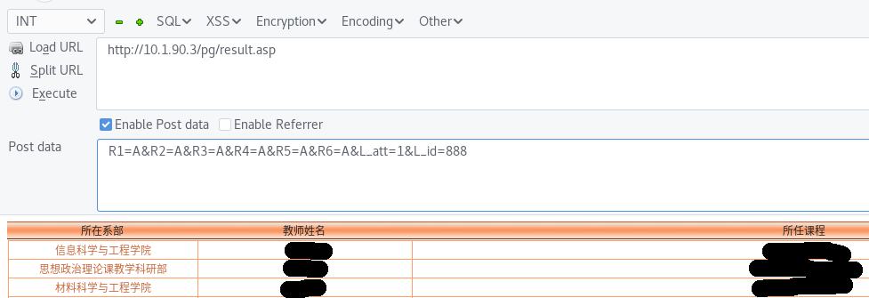

# <del>Semi</del> Auto Rate

一个<del>半自动</del>全自动的快速给教师评分的POST数据收集和自动评分脚本的仓库。不希望了解原理的话，用法在最下方。

# 声明

**严禁用作任何商业用途！**

# 原理

CQJTU使用了一个方法让没有给教师评分（官方称呼为“网评”）的学生无法使用正方教务网，而给每个教师评分需要强行等待30秒，JS脚本如下：
```
<script type="text/javascript"> 
var butt = document.getElementById('send'); 
function showTime(s)
{
s=s-1;
if (s<=0)
{
butt.disabled=false;
 butt.value="提交";
 }
 else
{
document.getElementById('send').value=s+"秒后可提交";
setTimeout("showTime("+s+")", 1000);
}
}
showTime(30);
</script>
```
如果仅仅是粗暴的Noscript会导致完全无法点击按钮。稍微看了一下源码包含以下字段：
```
<form method="POST" action="result.asp">
```
所以只要把POST数据稍微拦截一下就可以了～
经过一小段时间的尝试后发现可以使用以下方法进行快速提交：

# 半自动提交使用方法

登陆到CQJTU的教师评分网站(10.1.90.3/pg/).

使用Firefox下的HackBar插件（或者其他类似功能的插件/脚本都行），可以直接针对一个页面进行POST操作。


POST的地址:
```
http://10.1.90.3/pg/result.asp
```
POST数据:(L_id在那个评分页面中每个课程的链接地址的最后，比如http://10.1.90.3/pg/Lesson.asp?L_id=888) 
```
R1=A&R2=A&R3=A&R4=A&R5=A&R6=A&L_att=1&L_id=888
```
由于有系统限制不能所有的项目都是A，所以请随意修改一个A为B或者其他的。
可选的有：A,B,C,D,E。

# 全自动提交的使用方法

使用autorate.py，使用Python3，运行前修改文件19行的UID为你的真实学号。

十分感谢[jazoma](https://github.com/jazoma)提供的优雅的全自动脚本！

# 声明

* 仅仅是出于对宝贵时间的节省<del>以及对于那个写的丑陋的页面的厌恶</del>才想出的这个方案，我明白绕开官方的限制是违背了设计的初衷的<del>叫你丫的系统设计这么烂</del>。所以除非你整天忙得不可开交，还是建议少用这个方法。
* 如果你是友好的设计者，我们可以一起探讨一下页面美化和使用的动态语言的问题。如果你是不友好的学校，请给这个仓库一个Star，然后来打我啊：P

# TODO:
- [ ] 对系统做进一步分析，做到可以完成评满分，和最低分
- [x] 制作一个全自动脚本自遍历页面中所有可以评分的科目给所有教师一键自动评分
